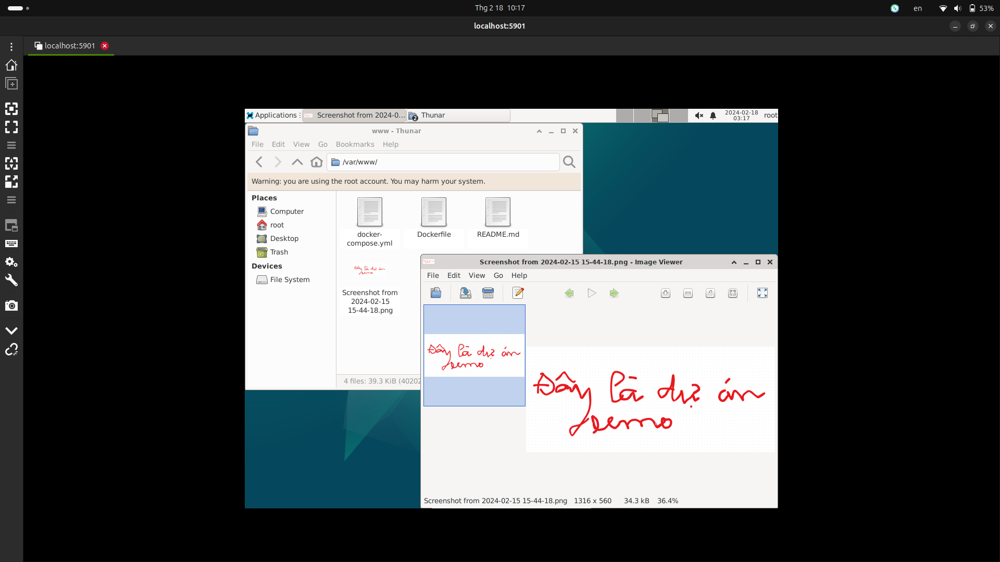

# bai tap tet

## Nguyễn Quang Thành - 21020791

## Phần 1: Các khái niệm
### docker

1. Docker là một nền tảng mở cho phép tự động triển khai ứng dụng vào các container ảo hóa, giúp giảm sự phụ thuộc vào hạ tầng. Nó cung cấp một lớp trừu tượng và tự động ảo hóa dựa trên Linux. Docker đóng gói phần mềm vào các đơn vị tiêu chuẩn hóa, bao gồm thư viện, công cụ hệ thống, mã và thời gian chạy, giúp dựng, kiểm thử và triển khai ứng dụng một cách nhanh chóng.

2. Docker Compose là một công cụ hỗ trợ xác định và chạy các ứng dụng multi-container. Với Docker Compose, bạn sử dụng file YAML để cấu hình các services cho ứng dụng của bạn. Sau đó, bạn sử dụng các lệnh để tạo và chạy từ những cấu hình đó. Docker Compose giúp quản lý nhiều container một cách dễ dàng và hiệu quả.

### linux, unix, bsd, \*nix

1. Linux là một họ các hệ điều hành tự do nguồn mở tương tự Unix và dựa trên Linux kernel, một hạt nhân hệ điều hành được phát hành lần đầu tiên vào ngày 17 tháng 9 năm 1991, bởi Linus Torvalds.
2. Unix là một họ hệ điều hành máy tính đa nhiệm, đa người dùng được viết vào những năm 1960 và 1970 do một số nhân viên của Bell Labs thuộc AT&T bao gồm Ken Thompson, Dennis Ritchie và Douglas McIlroy và một số người khác.
3. Berkeley Software Distribution (BSD) là một hệ điều hành dẫn xuất từ UNIX được phát hành vào thập niên 1970 từ trường Đại học California tại Berkeley. Tên này cũng được sử dụng cho các bản phân phối sau này.

4. \*nix là một thuật ngữ được sử dụng để chỉ các hệ điều hành hoạt động theo cách tương tự như hệ thống Unix, trong khi không nhất thiết phải tuân thủ hoặc được chứng nhận với bất kỳ phiên bản nào của Single UNIX Specification..

5. macOS, trước đây được gọi là OS X và Mac OS X, được xây dựng trên Darwin, một hệ điều hành Unix. Darwin được phát triển từ NeXTSTEP, FreeBSD, và các hệ điều hành BSD khác. macOS đã được đăng ký là một sản phẩm tuân thủ UNIX 03 từ phiên bản 10.5, vì vậy nó được xem là một hệ điều hành Unix. Tuy nhiên, macOS cũng chứa nhiều API không có trong BSD, bao gồm hầu hết mọi thứ liên quan đến giao diện người dùng - đồ họa, âm thanh, v.v

### apline, ubuntu

1. Alpine Linux là một hệ điều hành Linux nhẹ nhàng, bảo mật và hiệu quả. Nó được thiết kế để tối ưu hóa việc sử dụng tài nguyên và cung cấp một hệ thống tối giản nhưng đầy đủ chức năng.

2. Ubuntu là một hệ điều hành máy tính dựa trên Debian GNU/Linux, một bản phân phối Linux thông dụng. Ubuntu được xây dựng với mã nguồn mở, dựa trên nền tảng Debian GNU/Linux. Ubuntu có rất nhiều tính năng hữu ích cho các máy tính xách tay, desktop và cả máy chủ. Ubuntu được tài trợ bởi Canonical Ltd.

### VNC

VNC (Virtual Network Computing) là một công nghệ kĩ thuật dùng để chia sẻ giao diện màn hình từ xa (remote desktop sharing). VNC sẽ giúp người dùng hiển thị được màn hình của máy tính hoặc hệ thống ở xa ngay trên máy tính local của người dùng và có thể điều khiển thao tác qua kết nối mạng.

Công nghệ VNC Server sử dụng giao thức TCP và cổng 5900 trở lên. Nó hoạt động bằng cách ghi nhận nội dung framebuffer và chia sẻ chúng với VNC Client. 

VNC được phát triển tại Cambridge vào cuối những năm 1990 bởi những người sáng lập của RealVNC và đã trở thành một công nghệ phổ biến trong việc truy cập và điều khiển máy tính từ xa.

## Phần 2: Demo
1. chay `docker-compose up`
2. sau khi build và chạy container thành công thì gõ lệnh `docker-compose exec app bash`
 sau đó ở `/var/www#` gõ các lệnh như sau 
    - touch /root/.Xresources
    - apt-get install dbus-x11
    - apt-get install x11-xserver-utils`
    - export USER=root
    - vncserver
3. vào `vnc-viewer` xem dự án bằng địa chỉ `localhost:5901`
4. link demo https://youtube.com/live/L0XxI_SPIfA?feature=share
5. Ảnh minh chứng
